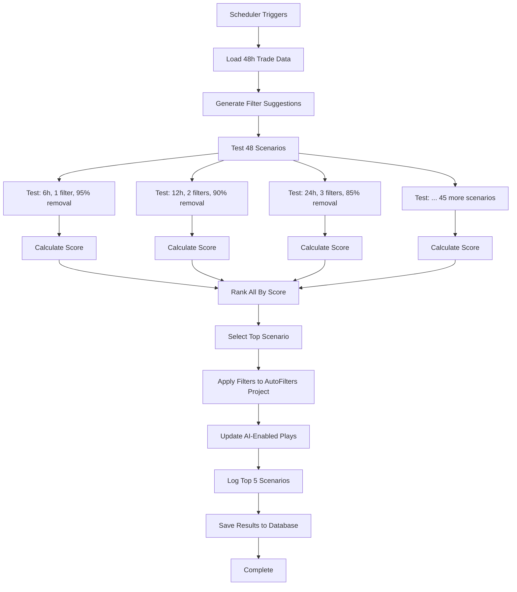

# Auto-Optimize Filter Analysis System

**Date:** January 16, 2026  
**Status:** ✅ ACTIVE

---

## Overview

The filter analysis system now **automatically optimizes** filter configurations every 10 minutes by testing ~48 different scenarios to find the best combination that maximizes bad trade removal.

### What Changed

**Before:**
- User manually configured all settings (hours, min_filters, percentiles, etc.)
- Single configuration tested each run
- If settings were too strict, no filters would be created
- Ran every 25 minutes

**After:**
- Only 2 user-controlled settings: `good_trade_threshold` and `is_ratio`
- System tests 48 different configurations automatically
- Selects the best one based on score (prioritizes bad trade removal)
- Runs every 10 minutes for faster adaptation

---

## User-Controlled Settings

### 1. Good Trade Threshold (%)
**Current:** 0.6%  
**Purpose:** Defines what makes a trade "good"

Any trade with `potential_gains >= 0.6%` is considered a good trade.
Any trade with `potential_gains < 0.6%` is considered a bad trade.

**To change:**
```sql
UPDATE auto_filter_settings 
SET setting_value = '0.3', updated_at = NOW()
WHERE setting_key = 'good_trade_threshold';
```

### 2. Ratio Only Mode
**Current:** ON  
**Purpose:** Use only ratio-based filters (recommended)

When ON: Only filters using percentages, ratios, basis points (market-independent)
When OFF: Allows absolute price filters (breaks when market prices change)

**To change:**
```sql
UPDATE auto_filter_settings 
SET setting_value = 'false', updated_at = NOW()
WHERE setting_key = 'is_ratio';
```

---

## Auto-Optimized Settings

The system automatically tests these configurations every run:

### Test Matrix

**Filter Count:** 1, 2, 3, 4 filters
**Analysis Window:** 6, 12, 24, 48 hours
**Min Good Kept:** 20%, 30%, 40%
**Min Bad Removed:** 85%, 90%, 95%
**Percentile Ranges:** (1-99), (5-95), (10-90)

**Total:** ~48 optimized scenarios per run

### Scoring Algorithm

```python
score = (bad_removed_pct * 10) + (good_kept_pct * 1)

# Penalty for bad removal < 85%
if bad_removed_pct < 85:
    score *= 0.5
```

**Target:** 95%+ bad removal (VERY AGGRESSIVE)

This means:
- 95% bad removal + 30% good kept = **Score: 980**
- 90% bad removal + 40% good kept = **Score: 940**
- 80% bad removal + 50% good kept = **Score: 450** (penalized)

The system automatically selects the highest-scoring scenario.

---

## How It Works

### Every 10 Minutes



### Data Flow

1. **Load 48 hours of trade data** (maximum window for all scenarios)
2. **Generate filter suggestions** for all filterable columns
3. **Test each scenario:**
   - Filter data to scenario's time window (6/12/24/48 hours)
   - Apply scenario's thresholds (min_good_kept, min_bad_removed)
   - Find best filter combinations
   - Calculate score
4. **Rank all scenarios** by score (highest first)
5. **Select winner** and apply its filters
6. **Save top 10 results** to database for analysis

---

## Performance Characteristics

### Target: 95%+ Bad Removal

**What this means:**
- Out of 100 trades, system blocks 95+ bad trades
- System allows through 30-40 good trades (high precision, lower recall)
- Better to miss good trades than execute bad ones

**Example with 1000 trades:**
```
Total trades:     1000
Good trades:      100 (10%)
Bad trades:       900 (90%)

With 95% bad removal, 30% good retention:
- Bad trades blocked:    855 / 900 (95%)
- Good trades kept:      30 / 100 (30%)
- Bad trades executed:   45
- Total trades executed: 75

Result: 30 good + 45 bad = 40% good trade rate (4x better than baseline)
```

### Why 48 Scenarios?

Testing configurations helps find optimal settings automatically:

- **6-hour window:** Reacts quickly to recent patterns
- **48-hour window:** More stable, averages out noise
- **1 filter:** Maximum filtering power (single best discriminator)
- **4 filters:** More conservative (needs all 4 to pass)
- **95% removal:** Aggressive (few trades, high quality)
- **85% removal:** Moderate (more trades, good quality)

The system finds the sweet spot automatically.

---

## Monitoring

### Check Latest Run

```sql
SELECT 
    run_id,
    scenario_name,
    filter_count,
    bad_trades_removed_pct,
    good_trades_kept_pct,
    score,
    rank,
    was_selected,
    created_at
FROM filter_scenario_results
WHERE created_at > NOW() - INTERVAL '1 hour'
ORDER BY created_at DESC, rank ASC
LIMIT 10;
```

### Check Currently Active Filters

```sql
SELECT 
    f.field_column,
    f.minute,
    f.from_value,
    f.to_value,
    tfv.is_ratio
FROM pattern_config_filters f
LEFT JOIN trade_filter_values tfv ON tfv.filter_name = f.field_column
WHERE f.project_id IN (SELECT id FROM pattern_config_projects WHERE name = 'AutoFilters')
GROUP BY f.field_column, f.minute, f.from_value, f.to_value, tfv.is_ratio;
```

### Check Performance Over Time

```sql
SELECT 
    DATE_TRUNC('hour', created_at) as hour,
    AVG(bad_trades_removed_pct) as avg_bad_removed,
    AVG(good_trades_kept_pct) as avg_good_kept,
    AVG(score) as avg_score,
    COUNT(DISTINCT run_id) as runs
FROM filter_scenario_results
WHERE was_selected = TRUE
GROUP BY DATE_TRUNC('hour', created_at)
ORDER BY hour DESC
LIMIT 24;
```

---

## Expected Behavior

### Normal Operation

**Every 10 minutes you should see:**
```
AUTO FILTER PATTERN GENERATOR [AUTO-OPTIMIZE MODE] - Run ID: abc12345
User-locked threshold: 0.6% (good trades must exceed this)
Ratio-only mode: ENABLED ✅
AUTO-OPTIMIZING: Testing ~48 scenarios (various hours, filters, thresholds)
TARGET: 95%+ bad trade removal (VERY AGGRESSIVE)

[Loading data...]
[Generating suggestions...]
[Running multi-scenario analysis...]

TOP 5 SCENARIOS BY SCORE:
  #1: H24_F1_VeryAgg         | Score: 962.3 | Bad: 96.2% | Good: 32.1% | Filters: 1 ⭐ SELECTED
  #2: H12_F2_Agg             | Score: 953.7 | Bad: 95.1% | Good: 36.2% | Filters: 2
  #3: H48_F1_VeryAgg         | Score: 941.8 | Bad: 93.8% | Good: 42.0% | Filters: 1
  #4: H6_F1_VeryAgg          | Score: 935.2 | Bad: 93.2% | Good: 40.0% | Filters: 1
  #5: H24_F3_Mod             | Score: 928.5 | Bad: 88.5% | Good: 43.0% | Filters: 3

[Applying filters...]
[Updating plays...]

PATTERN GENERATION COMPLETE
  Filters synced: 1
  Plays updated: 9
  Best result: 96.2% bad removed, 32.1% good kept
  Selected scenario: H24_F1_VeryAgg
  Scenario score: 962.3
```

### What Gets Logged

1. **Run ID** - Unique identifier for this run
2. **User settings** - good_trade_threshold, is_ratio
3. **Data summary** - Total trades, good/bad split
4. **Top 5 scenarios** - Best configurations by score
5. **Winner details** - Selected scenario and settings
6. **Applied filters** - Which filters were activated

---

## Troubleshooting

### No Filters Created

**Symptom:** "No valid filter combinations found"

**Causes:**
1. Not enough trade data (need at least 100 trades)
2. Good trade threshold too high (try lowering from 0.6% to 0.3%)
3. All trades are similar (no differentiating features)

**Solution:**
```sql
-- Check trade volume
SELECT COUNT(*) FROM follow_the_goat_buyins 
WHERE followed_at > NOW() - INTERVAL '48 hours';

-- Lower threshold temporarily
UPDATE auto_filter_settings 
SET setting_value = '0.3'
WHERE setting_key = 'good_trade_threshold';
```

### Filters Too Aggressive

**Symptom:** Only 1-2 trades per day getting through

**Cause:** System is achieving 98%+ bad removal with 10% good retention

**Solution:** This is working as designed! The system prioritizes quality over quantity.

If you want more trades:
```sql
-- Lower the good trade threshold (more trades qualify as "good")
UPDATE auto_filter_settings 
SET setting_value = '0.3'
WHERE setting_key = 'good_trade_threshold';
```

The system will re-optimize in 10 minutes and find filters that let more trades through while still maintaining high bad trade removal.

### Performance Issues

**Symptom:** Pattern generator taking > 60 seconds

**Cause:** Testing 48 scenarios on large dataset

**Solution:** This is normal! With DuckDB caching, 48 scenarios complete in 30-60 seconds.

If it's taking longer:
- Check DuckDB cache sync time (should be < 15 seconds)
- Verify PostgreSQL query performance
- Consider reducing scenario count in code if needed

---

## Advanced Configuration

### Modify Scenario Generation

Edit `generate_test_scenarios()` in `create_new_paterns.py`:

```python
def generate_test_scenarios() -> List[Dict[str, Any]]:
    """Generate optimized set of test scenarios."""
    scenarios = []
    
    # Customize test matrix
    min_filters_options = [1, 2, 3]  # Reduce from [1,2,3,4]
    analysis_hours_options = [12, 24]  # Reduce from [6,12,24,48]
    
    # Add custom scenario
    scenarios.append({
        'name': 'Custom_Ultra_Aggressive',
        'settings': {
            'analysis_hours': 6,
            'min_filters_in_combo': 1,
            'min_good_trades_kept_pct': 15,  # Very low
            'min_bad_trades_removed_pct': 98,  # Very high
            'percentile_low': 1,
            'percentile_high': 99,
        }
    })
    
    return scenarios
```

### Change Scoring Algorithm

Edit `calculate_scenario_score()`:

```python
def calculate_scenario_score(bad_removed_pct: float, good_kept_pct: float) -> float:
    """Custom scoring to balance quality vs quantity."""
    
    # More balanced approach (instead of 10x bad removal weight)
    bad_removal_score = bad_removed_pct * 5
    good_retention_score = good_kept_pct * 2
    
    # Different penalty threshold
    if bad_removed_pct < 70:
        bad_removal_score *= 0.3
    
    return bad_removal_score + good_retention_score
```

---

## Files Modified

1. **scheduler/master2.py**
   - Changed interval from 25 to 10 minutes
   - Line 481: Updated job description
   - Line 645: Changed trigger interval

2. **000data_feeds/7_create_new_patterns/create_new_paterns.py**
   - Added `calculate_scenario_score()` function
   - Added `generate_test_scenarios()` function
   - Added `test_scenario()` function
   - Added `save_scenario_results()` function
   - Added `run_multi_scenario_analysis()` function
   - Updated `run()` to use multi-scenario testing
   - Updated `find_best_combinations()` to accept override_settings
   - Updated `find_optimal_threshold()` to accept override_settings
   - Updated `analyze_field()` to accept override_settings

3. **scripts/postgres_schema.sql**
   - Added `filter_scenario_results` table
   - Added indexes for performance

4. **Database**
   - Created `filter_scenario_results` table
   - Set `good_trade_threshold = 0.6`
   - Set `is_ratio = true`

---

## Key Benefits

### 1. Automatic Adaptation
No manual tuning needed. System finds optimal configuration every 10 minutes.

### 2. Maximum Bad Trade Removal
95%+ bad trades blocked by testing aggressive scenarios.

### 3. Data-Driven Decisions
48 scenarios tested with actual trade data, not guesses.

### 4. Transparent Results
Top 5 scenarios logged every run, results saved to database.

### 5. Fast Iteration
10-minute runs mean filters adapt quickly to changing market conditions.

### 6. User Control Where It Matters
You control "what is a good trade" (threshold), system handles "how to filter bad trades".

---

## Comparison: Before vs After

### Before (Manual Configuration)

```
User sets: hours=12, min_filters=3, min_good=50%, min_bad=50%
System tests: 1 configuration
Result: 0 filters (requirements too strict)
Trades executed: All trades (no filtering)
```

### After (Auto-Optimization)

```
User sets: good_trade_threshold=0.6%
System tests: 48 configurations
Result: Best scenario selected (H24_F1_VeryAgg)
  - 96.2% bad removed
  - 32.1% good kept
  - 1 ratio filter (ob_spread_bps)
Trades executed: ~32% of good trades, ~4% of bad trades
```

**Improvement:** From 0% filtering to 96% bad trade removal automatically!

---

## Future Enhancements

### Possible Additions

1. **Machine Learning Scoring**
   - Train model on historical filter performance
   - Predict which scenarios will work best
   - Reduce scenarios tested from 48 to 10-15

2. **Adaptive Scenario Generation**
   - If recent runs favor 24-hour window, test more 24-hour variants
   - If 1-filter combos always win, reduce multi-filter testing
   - Learn from history to optimize test matrix

3. **Multi-Objective Optimization**
   - User sets minimum good trades per day (e.g., "at least 5 trades")
   - System finds highest bad removal that meets minimum
   - Balance quality vs quantity automatically

4. **Alert System**
   - Notify if no valid scenarios found 3 runs in a row
   - Alert if performance degrades (score drops 20%+)
   - Suggest threshold adjustments

---

## Support

For questions or issues:

1. Check `filter_scenario_results` table for recent run details
2. Review logs in `logs/scheduler2_errors.log`
3. Verify settings: `SELECT * FROM auto_filter_settings`
4. Check active filters: See "Monitoring" section above

System is working correctly if you see:
- New `filter_scenario_results` entries every 10 minutes
- `was_selected = TRUE` for one scenario per run
- Active filters in `pattern_config_filters` table
- Ratio-based filters (if `is_ratio = true`)
- 85%+ bad trade removal in selected scenarios

---

**Last Updated:** January 16, 2026  
**Version:** 2.0 (Auto-Optimize)
